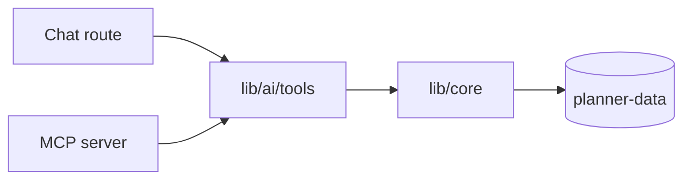

# Write a note worth reading later

A Planner note is not a wiki page. It is the only record of what has **already
been built** — how a thing is put together, which decisions are settled, what
breaks if you touch it. Charters and tasks point forward; notes point at what
is true now.

You are writing for one reader: a person or agent, six months from now, who has
lost all the context you currently have. Everything below follows from that.

## Before you write anything

`search_knowledge` for the topic and for the project slug, then `read_note` on
every plausible hit. **A summary is not enough** to know whether something is
already recorded.

If a note already covers the subject, `update_note`. Do not file a second one —
near-duplicates are silently merged away, so a second note is usually a no-op
you will never be told about. One subject, one note, revised over time.

## The summary is a claim, not a topic

`summary` is a single line, and it is the **only** text ever auto-loaded into a
context window. It has to carry the finding by itself, because most of the time
nothing else will be read.

- ✗ `Notes on how the lock works`
- ✓ `Every lib/core write takes one lock; it is not re-entrant, so nesting deadlocks`

If the summary could be the title of a chapter rather than the point of one,
rewrite it.

## Explain it in the order someone needs it

Four moves, in this order. Most notes need only the first three.

1. **The conclusion first.** What is true, in one or two sentences. Never open
   with background — a reader who stops after the first line should still leave
   with the answer.
2. **The mechanism.** How it actually works, concretely, naming real files,
   functions and fields. `withDataLock` chains on one module-level tail, not
   "there is a locking abstraction".
3. **The trap.** What looks reasonable and is wrong. This is the highest-value
   paragraph in most notes, and it is the one people skip writing, because it
   is obvious to whoever just learned it and invisible to everyone else.
4. **What it cost.** Only when the history changes a future decision — the
   thing that was tried and abandoned, so nobody re-tries it.

Prefer the concrete to the general: one real example beats three sentences of
description. If a rule has an exception, put it beside the rule, not in a
caveats section nobody reaches.

Write plainly. Short sentences. No throat-clearing ("It is important to note
that…"), no restating the title, and no summary paragraph at the end repeating
what the note just said.

## Reach for a picture when the words are working too hard

Two kinds, and they are not interchangeable.

**Diagrams are mermaid fences**, written in the body:

````

````

They are **text**, so they diff in git, survive a rename, and you can write one
without leaving the note. Use them for structure and flow: what calls what, what
happens in which order, what blocks what. `securityLevel` is `strict`, so raw
HTML in labels will not render — keep labels to plain text.

**Screenshots are for what a diagram cannot claim**: what a screen actually
looks like, a real error, output you want quoted exactly. Attach one with
`attach_image` (`path` on your own filesystem, `noteId`, and an `alt` that says
what the picture *shows*, not "screenshot"). Images are content-addressed, so
attaching identical bytes twice costs one file. **SVG is refused on purpose** —
served same-origin it can execute script — which is the other reason diagrams
are mermaid.

A picture that repeats the paragraph above it earns nothing. Add one where the
prose is straining: five or more moving parts, a shape that is hard to hold in
your head, or a layout you would otherwise describe left-to-right in words.

## Filing it

- **`scope`** is what makes a note findable and auto-loadable: the project slug,
  or `area:<slug>`. A scopeless note is searchable but never loaded on its own.
  Scoped notes are what fills a project's docs page.
- **The first tag groups it** on that page. Prefer `architecture`, `protocol`,
  `decision`, `runbook`, `reference` — in that order of preference — then
  anything else. An untagged note lands under "Unfiled".
- **`[[K-009]]` links become arrows on the canvas.** Link where the relationship
  is real, and let the prose carry the rest: every link is a line on the board,
  and a board where each note cites two others is unreadable.
- Notes live in `knowledge/`, so they do **not** archive with a charter.
  Documentation deliberately outlives its project.

## The shape of a finished note

```markdown
---
title: The data lock is not re-entrant
summary: Every lib/core write takes one lock; nesting two deadlocks the process
scope: [planner]
tags: [architecture, concurrency]
---

`withDataLock` serialises every write to the data repo, and it is **not**
re-entrant: a locked function calling another locked function hangs for ever.

It chains on one module-level `tail` promise, so an inner call waits on the
outer call that is waiting on it. That is why `logDaily` stays a plain delegator
to `logHabit`, and why each writer wraps a private `…Unlocked` function instead
of a sibling.

The trap: this looks like an ordinary mutex, and ordinary mutexes in Node are
usually re-entrant by accident because they are per-call. This one is per
module, so the deadlock only appears when two locked paths are composed — which
no single-writer test ever does. See [[K-014]] for the race that motivated it.
```

Note what that does: the claim in the summary, the mechanism with real names,
then the trap. No preamble, and no picture — because at four moving parts, the
words were still doing fine.
